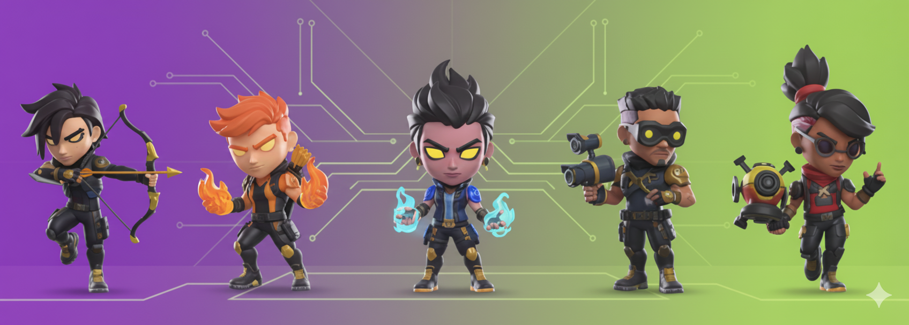

# AgentCraft Collectibles Store - Mi tienda

Tienda online de coleccionables gaming con diseño moderno y totalmente responsive. Proyecto desarrollado con HTML, CSS y JavaScript vanilla.



## Descripción

**AgentCraft** es una tienda online especializada en figuras coleccionables, merchandising y productos gaming. El proyecto presenta un diseño moderno con gradientes vibrantes (morado y verde lima), animaciones suaves y una experiencia de usuario optimizada para todos los dispositivos.

### Características Principales

- **Diseño Moderno**: Interfaz atractiva con gradientes personalizados y efectos glassmorphism
- **Totalmente Responsive**: Adaptado para desktop, tablet y móviles con breakpoints optimizados
- **Búsqueda de Productos**: Sistema de búsqueda en tiempo real
- **Filtrado por Categorías**: Organización de productos por categorías (Figurines, Mangas, Games, Others)
- **Menú Hamburguesa**: Navegación móvil intuitiva con menú lateral deslizante
- **Localizador de Tiendas**: Mapa interactivo con ubicaciones de tiendas físicas
- **Animaciones Suaves**: Transiciones y efectos hover para mejorar la experiencia
- **Accesibilidad**: Etiquetas ARIA y estructura semántica HTML5

## Estructura del Proyecto

```tree
mi-tienda/
├── index.html              # Página principal con productos destacados
├── tienda.html            # Catálogo completo de productos
├── css/
│   └── styles.css         # Estilos CSS con diseño responsive
├── js/
│   └── script.js          # Funcionalidad JavaScript
├── images/                # Recursos gráficos
│   ├── agentcraft_logo.png
│   ├── banner.png
│   └── [productos].png
└── README.md
```

## Tecnologías Utilizadas

- **HTML5**: Estructura semántica y accesible
- **CSS3**:
  - Variables CSS para diseño consistente
  - Flexbox y CSS Grid para layouts
  - Media queries para diseño responsive
  - Animaciones y transiciones CSS
- **JavaScript (ES6+)**:
  - Módulos y funciones puras
  - Event delegation
  - DOM manipulation
- **Google Fonts**: Tipografías Outfit e Inter

## Diseño Responsive

El proyecto implementa una estrategia de diseño mobile-first con los siguientes breakpoints:

| Dispositivo | Breakpoint | Características |
|-------------|------------|-----------------|
| **Desktop** | > 1024px | Diseño completo con sidebar lateral |
| **Tablet** | 601px - 1024px | Navegación simplificada, sidebar arriba |
| **Móvil** | ≤ 600px | Menú hamburguesa, layout vertical |
| **Móvil Pequeño** | ≤ 480px | Optimizaciones adicionales |

### Adaptaciones por Dispositivo

#### Desktop (> 1024px)

- Header con logo, búsqueda y navegación horizontal
- Sidebar de categorías fijo (sticky)
- Grid de productos en 2 columnas
- Footer en 3 columnas

#### Tablet (601px - 1024px)

- Barra de búsqueda debajo de la navegación
- Sidebar de categorías estático arriba del contenido
- Grid de productos en 2 columnas
- Footer en 3 columnas compactas

#### Móvil (≤ 600px)

- Menú hamburguesa lateral deslizante
- Logo centrado (solo en index.html)
- Productos en 1 columna
- Footer apilado verticalmente
- Categorías accesibles desde menú hamburguesa

## Instalación y Uso

### Opción 1: Abrir Directamente

1. Clona el repositorio:

```bash
git clone https://github.com/AlvaroMP01/mi_tienda.git
cd mi_tienda
```

2. Abre `index.html` en tu navegador favorito

## Páginas del Sitio

### index.html

Página principal que incluye:

- Hero section con banner llamativo
- Productos destacados en scroll horizontal
- Producto showcase destacado
- Localizador de tiendas con mapa interactivo
- Footer con enlaces y redes sociales

### tienda.html

Catálogo completo con:

- Hero section específico de tienda
- Sidebar de categorías (desktop)
- Grid completo de productos
- Sistema de filtrado por categorías
- Búsqueda de productos

## Funcionalidades JavaScript

El archivo `script.js` implementa las siguientes funcionalidades:

### Menú Hamburguesa

```javascript
MenuHandler.toggle()  // Abre/cierra el menú
MenuHandler.close()   // Cierra el menú
```

### Búsqueda de Productos

- Búsqueda en tiempo real por nombre de producto
- Compatible con formularios desktop y móvil
- Feedback visual cuando no hay resultados

### Filtrado por Categorías

- Filtrado dinámico por categoría
- Animación fadeIn al mostrar productos
- Sincronización entre sidebar desktop y menú móvil

### Scroll Horizontal

- Scroll horizontal con rueda del ratón en carrusel de productos
- Mejora la experiencia de navegación en desktop

### Smooth Scroll

- Navegación suave a secciones ancladas
- Mejora la experiencia de usuario

## Paleta de Colores

```css
/* Colores principales */
--purple-primary: #9a48d0;
--purple-dark: #7a3aa8;
--purple-light: #b86de6;
--lime-green: #bed149;
--lime-dark: #a8ba3d;

/* Colores neutros */
--white: #ffffff;
--black: #000000;
--gray-light: #f5f5f5;
--gray-medium: #cccccc;
--gray-dark: #333333;
```

## Personalización

### Cambiar Colores

Edita las variables CSS en `styles.css` (líneas 9-22):

```css
:root {
  --purple-primary: #TU_COLOR;
  --lime-green: #TU_COLOR;
  /* ... */
}
```

### Añadir Productos

En `tienda.html`, añade un nuevo artículo:

```html
<article class="product-card" data-category="TU_CATEGORIA">
  <h3 class="product-name">Nombre del Producto</h3>
  
  <p class="product-price">XX.XX €</p>
  <button class="product-btn">Add to Cart</button>
</article>
```

### Añadir Categorías

1. Añade el item en el sidebar (desktop) y menú hamburguesa (móvil)
2. Asigna el atributo `data-category` a los productos correspondientes

## SEO y Accesibilidad

- Meta tags descriptivos en cada página
- Etiquetas semánticas HTML5 (`<header>`, `<nav>`, `<main>`, `<section>`, `<article>`, `<footer>`)
- Atributos `aria-label` en elementos interactivos
- Textos alternativos en todas las imágenes
- Estructura de headings jerárquica (h1 → h2 → h3)
- IDs únicos para elementos interactivos

## Solución de Problemas

### Las imágenes no se cargan

- Verifica que las rutas en `src` sean correctas
- Asegúrate de que las imágenes estén en la carpeta `images/`

### El menú hamburguesa no funciona

- Verifica que `script.js` esté correctamente enlazado
- Comprueba la consola del navegador para errores JavaScript

### Los estilos no se aplican

- Verifica que `styles.css` esté correctamente enlazado
- Limpia la caché del navegador (Ctrl + Shift + R)

## Autor

**Álvaro Moreno Pérez**

- GitHub: [@AlvaroMP01](https://github.com/AlvaroMP01)
- Proyecto: [mi_tienda](https://github.com/AlvaroMP01/mi_tienda)
